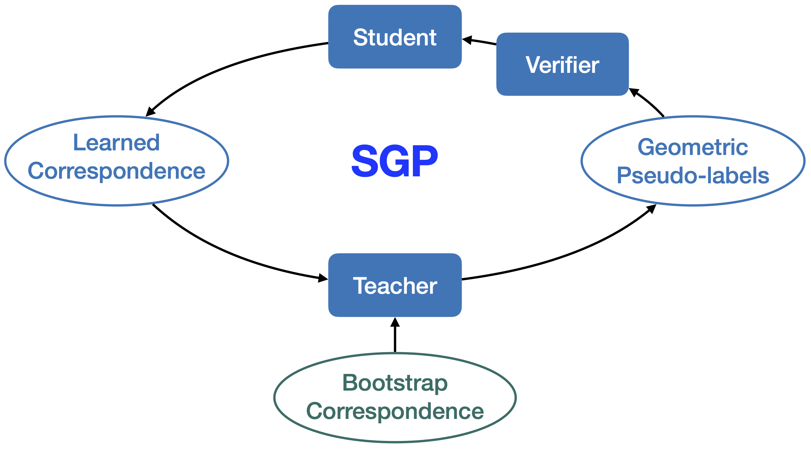
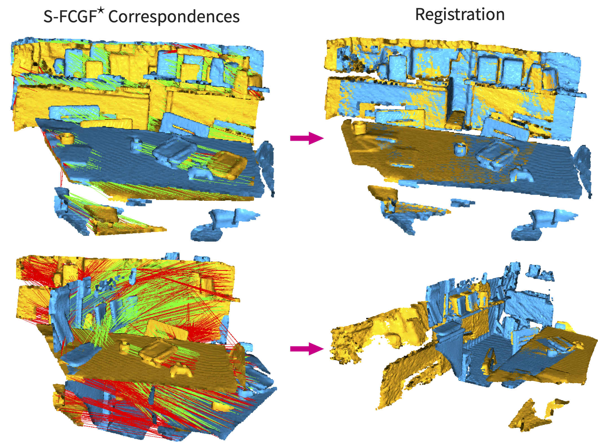

# SGP: Self-supervised Geometric Perception
[CVPR 2021 Oral] Self-supervised Geometric Perception 
https://arxiv.org/abs/2103.03114

## Introduction
In short, SGP is, to the best of our knowledge, the first general framework for feature learning in geometric perception without any supervision from ground-truth geometric labels. 

SGP runs in an EM fashion. It iteratively performs robust estimation of the geometric models to generate pseudo-labels, and feature learning under the supervision of the noisy pseudo-labels. 




We applied SGP to camera pose estimation and point cloud registration, demonstrating performance that is on par or even superior to supervised oracles in large-scale real datasets.

### Camera pose estimation

Deep image features like [CAPS](https://github.com/qianqianwang68/caps) can be trained with relative pose labels generated by 5pt-RANSAC, bootstraped with the handcrafted SIFT feature. They can be later used in robust relative camera pose estimation.

<div float="left">
  
   
</div>

### Point cloud registration

Deep 3D features like [FCGF](https://github.com/chrischoy/FCGF) can be trained with relative pose labels generated by 3pt-RANSAC, bootstraped by the handcrafted FPFH feature. They can be later used in robust point cloud registration.

<div float="left">
  
   
</div>


## Code

Please see `code/` for detailed intructions about how to use the code base.


## Citation

```
@inproceedings{yang2021sgp,
  title={Self-supervised Geometric Perception},
  author={Yang, Heng and Dong, Wei and Carlone, Luca and Koltun, Vladlen},
  booktitle={CVPR},
  year={2021}
}
```

